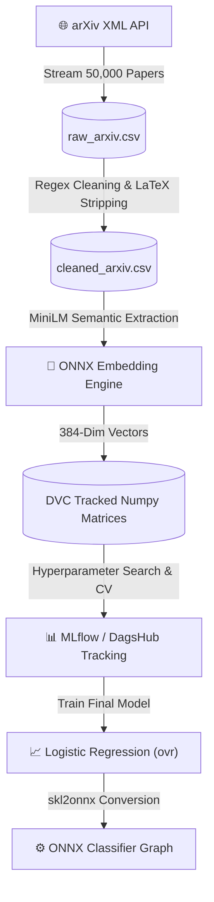
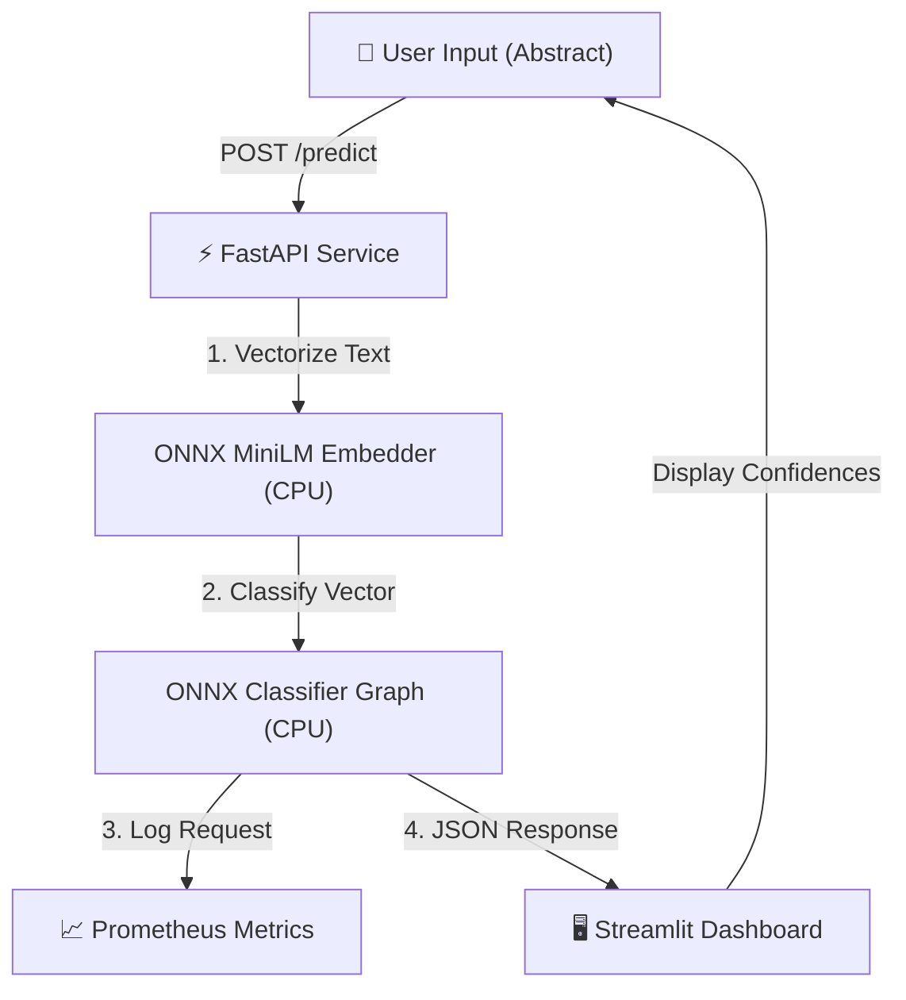
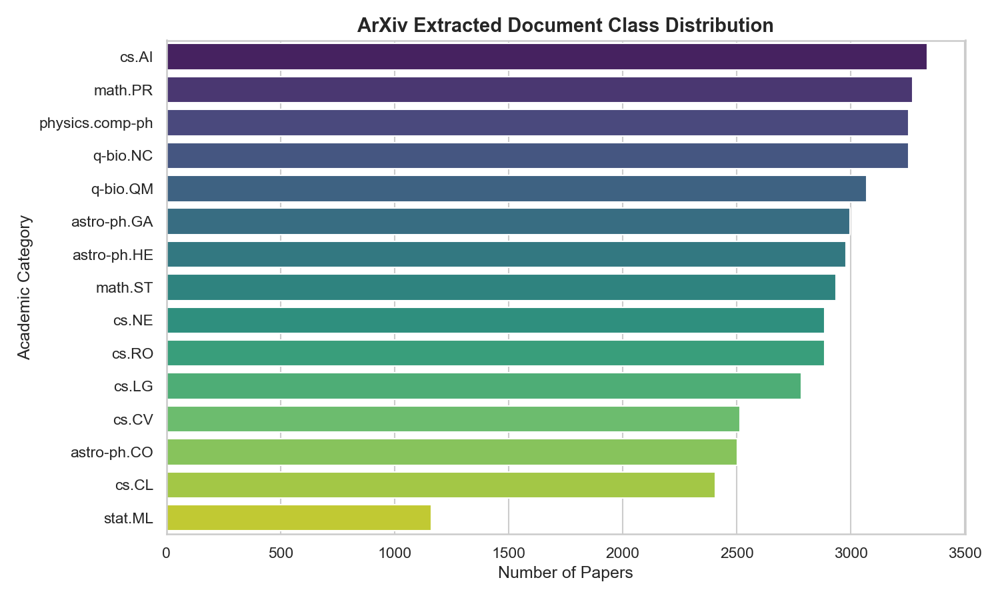
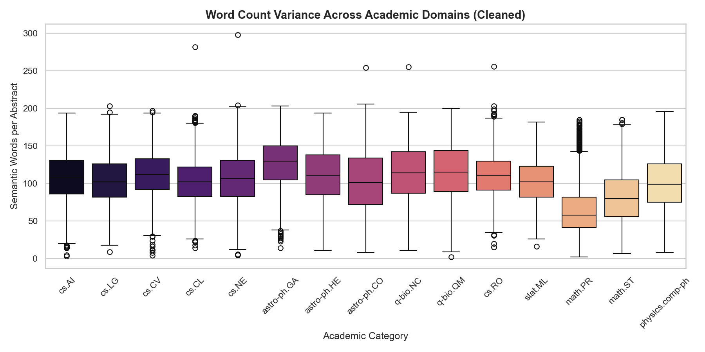

# 🚀 ResearchIQ: End-to-End Scientific Domain Classifier

<div align="center">
  
  
  
  
  
  
  
</div>

<br>

**ResearchIQ** is an industry-grade Machine Learning system designed to ingest, process, and classify scientific research abstracts into 15 overlapping academic domains (e.g., Astrophysics, Computer Vision, Statistics). 

It demonstrates a masterclass in modern MLOps by eschewing bloated PyTorch pipelines in favor of a lightning-fast, CPU-optimized **ONNX inference engine**, tracked remotely via **DagsHub/MLflow**, and deployed across containerized **FastAPI** and **Streamlit** surfaces.

---

## 🔗 Live Surfaces & Links

- **🚀 Live App (Hugging Face Spaces):** [https://huggingface.co/spaces/saibalajiomg/researchiq](https://huggingface.co/spaces/saibalajiomg/researchiq)
- **📊 Remote MLflow (DagsHub):** [https://dagshub.com/saibalajinamburi/researchiq/experiments](https://dagshub.com/saibalajinamburi/researchiq/experiments)

---

## 🌟 The Problem & The Solution

**The Problem:** 
The academic community publishes tens of thousands of papers monthly. Automatically categorizing massive streams of unstructured abstracts requires semantic understanding, but running heavy NLP models (like Transformers) natively in production usually demands expensive GPUs and massive memory overhead.

**The Solution:** 
ResearchIQ builds an optimized, end-to-end classification pipeline that understands semantic context without the bloat. By leveraging a quantized INT8 MiniLM embedding model and a compiled Scikit-Learn classifier running entirely inside **ONNX Runtime**, ResearchIQ achieves GPU-level inference speeds (<10ms) natively on standard CPU hardware.

---

## 🏗️ System Architecture

### 1. Training & Engineering Pipeline
*How the data was acquired, cleaned, versioned, and trained.*



### 2. Live Inference Deployment
*How the deployed application serves real-time predictions.*



---

## ⚠️ Key Engineering Challenges & Solutions

Building this pipeline required solving several complex, real-world engineering roadblocks:

| Challenge Faced | How I Solved It |
| :--- | :--- |
| **Monolithic PyTorch Bloat**<br>Loading standard HuggingFace PyTorch pipelines created 3GB+ virtual environments, making cloud deployment painfully slow and expensive. | **The ONNX Pivot**<br>I completely removed PyTorch from the deployment stack. I utilized a pre-compiled INT8 ONNX MiniLM model and converted my final Scikit-Learn classifier to `.onnx`. This reduced the runtime footprint to just the ONNX Runtime engine, cutting memory by 80% and dropping latency to `<10ms`. |
| **LaTeX Syntax Destruction**<br>arXiv abstracts are riddled with complex LaTeX mathematical formulas (`$\alpha = \beta^2$`). This appears as random noise to language models, destroying the semantic embedding space. | **Targeted Regex NLP**<br>I engineered a highly robust text-cleaning module (`src/cleaning.py`) that specifically targets and strips inline (`$...$`) and block (`$$...$$`) equations, URLs, and citation artifacts, leaving behind pure semantic English. |
| **Data Versioning Bloat**<br>Generating 384-dimensional embeddings for 42,000 papers created massive `.npy` matrices that would instantly break GitHub's size limits. | **DVC Integration**<br>I integrated Data Version Control (DVC) to track the heavy dataset artifacts externally, ensuring the main Git repository remained strictly focused on source code. |
| **Cloud Experiment Tracking**<br>Logging models locally (`.mlruns`) limited reproducibility and prevented the setup of cloud-native CI/CD pipelines. | **DagsHub Remote MLflow**<br>I integrated the training script directly with DagsHub (`dagshub.init`), seamlessly pushing all hyperparameters, metrics, and `.joblib` model weights to a centralized, remote tracking server. |

---

## 📊 Model Snapshot & Metrics

The final model achieves highly competitive accuracy across a challenging, heavily overlapping 15-class academic dataset.

- **Total Dataset:** 42,186 cleaned abstracts
- **Feature Space:** 384 dimensions (MiniLM embeddings)
- **Model Architecture:** Scaled Logistic Regression (One-vs-Rest)
- **Global Macro F1 Score:** `0.6655`
- **ONNX vs Sklearn Parity:** `1.0000` (100% label agreement during conversion testing)

### Data Insights

| Academic Category Balance | Abstract Word Length Variance |
| :---: | :---: |
|  |  |

---

## 💻 Local Quickstart

Want to run the complete FastAPI backend, Streamlit frontend, and MLflow server locally?

**1. Clone & Install**
```bash
git clone https://github.com/saibalajinamburi/researchiq.git
cd researchiq
pip install -r requirements.txt
```

**2. Launch the Stack**
```bash
# This starts FastAPI (8001), Streamlit (8502), and MLflow (5000)
python src/launch.py
```

**3. Access the Surfaces**
- **Streamlit Dashboard:** [http://localhost:8502](http://localhost:8502)
- **FastAPI Swagger Docs:** [http://localhost:8001/docs](http://localhost:8001/docs)
- **Prometheus Metrics:** [http://localhost:8001/metrics](http://localhost:8001/metrics)

**4. Stop Services**
```bash
python src/stop_services.py
```

---

## 📁 Project Structure

```text
researchiq/
├── data/                   # Raw CSVs and processed DVC matrices
├── deploy/hf_space/        # Lean deployment bundle for Hugging Face Spaces
├── models/                 # Final sklearn .joblib and exported .onnx graphs
├── reports/                # EDA figures, metrics, and training comparisons
├── src/                    # Core source code
│   ├── ingestion.py        # arXiv XML streaming pipeline
│   ├── eda.py              # Exploratory data analysis & plots
│   ├── preprocess.py       # ONNX embedding generation
│   ├── train.py            # MLflow experiment training loop
│   ├── export_onnx.py      # skl2onnx conversion script
│   ├── inference.py        # Central ONNX inference engine
│   ├── api.py              # FastAPI server
│   ├── streamlit_app.py    # Streamlit dashboard
│   └── launch.py           # Local service orchestrator
├── .dvc/                   # Data version control config
├── docker-compose.yml      # Orchestration for API + UI
├── Dockerfile.api          # Container definition for FastAPI
├── Dockerfile.streamlit    # Container definition for Streamlit
└── requirements.txt        # Pinned dependencies
```
